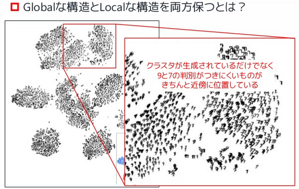

# LargeVis
Visualizing Large-scale and High-dimensional Data

- 大規模，高次元データに対する効率的な可視化，次元削減手法の提案．|
- t-SNEの上位互換とも言える |

---

## 背景
- **大規模，高次元データを2or3次元空間に射影して可視化したい！**
- 次元削減手法は色々あるが，どれも大規模，高次元データに対してはいまいち．

+++
## 既存手法
  - 線形の手法
    - PCA, MDS ... 線形なので実データにはあまり向かないことが多い
  - 非線形な手法
    - Isomap, LLE, Laplacian Eigenmaps等 ... 小規模なデータには良い結果を示すが，高次元の実データに対してはglobal,localな構造をよく表現できないことが多い |
    - t-SNEは上に比べると**global,localな構造を両方保っている** |

+++
### t-SNE

+++
### t-SNEの欠点
- K最近傍グラフの構築にvantage-point treeを使っており，計算コストが高い
- グラフの可視化ステップにおいてもデータ数に比例して効率が悪くなる
- パラメータに敏感．異なるデータに対する最適なパラメータが大きく異なる．

**→これらを主に改善したのがLargeVis.**

---

## contributions
- 数百万x数百次元のデータでも現実的に計算可能
- 高次元，大規模データに対する効率的なK最近傍(K-NN)グラフの構築をした
- パラメータの敏感さを解消
- グラフの可視化のための確率モデルの提案．
  - 目的関数は非同期SGDで効率的に最適化
    - 時間複雑度 $O(N)$，t-SNEは $O(N\log N)$
- 実データにおけるt-SNEとのパフォーマンス比較

---

## 大まかな流れ
1. データ(例えば高次元の特徴ベクトル)を用意
2. 距離を計算して，**K-NNグラフを構築**
3. グラフの可視化を行う

---

## K-NNグラフの構築
データ数$N$, 次元数$d$
- 正確に計算しようとすると， $O(N^2d)$

既存手法は大きく3つのカテゴリに分類できる
- space-partitioning trees
- locality sensitive hashing techniques
- neighbor exploring techniques

+++
## space-partitioning trees
- 全空間を木で幾つかの領域に分けていく
- 一度木が構築できれば，あとはたどるだけでK-NNグラフは構築できる！

+++
一度木が構築できれば，あとはたどるだけでK-NNグラフは構築できる！

e.g.,
- k-d trees
- vp-trees
- cover trees
- **Random Projection trees(RP-trees)**

+++
#### 結局アルゴリズムは？
RP-treeベースのアルゴリズム．
- 距離はeuclid
- 元のアルゴリズムより近傍の探索方法を工夫している．

---

## グラフの可視化
- よくある次元削減の方法(PCAからt-SNEとか)
- force-directedな方法

うまく可視化できるのはforce-directed(力指向)な方法だが，計算コストが高い．

+++
force-directedな手法:
- fruchterman-Reingo $O(N^2)$
- ForceAtlas  $O(N^2)$
- ForceAtlas2 $O(N\log N)$
- Openord $O(N\log N)$

---
## 余談

各種embeddingの手法を適用して100次元程度に落としてからLargeVisを適用するのもあり！

- [LINE: Large-scale information network embedding](https://github.com/tangjianpku/LINE):
  - 著者が以前提案したネットワークorグラフのembedding手法
- Skip-gram

---

APPENDIX

---
## 参考
- [Visualizing Large-scale and High-dimensional Data](https://arxiv.org/abs/1602.00370)
- [Ray tracing with BSP and Rope trees](http://old.cescg.org/CESCG-2000/JKrivanek/index.html)
- [t-SNEの解説スライド](https://www.slideshare.net/t_koshikawa/visualizing-data-using-tsne-56773191)
