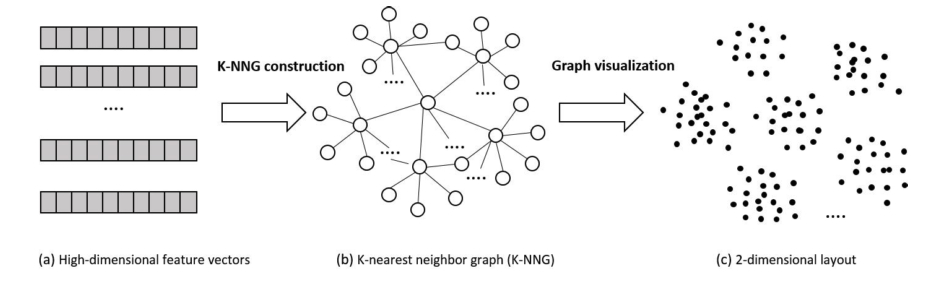

# LargeVis
Visualizing Large-scale and High-dimensional Data

- 大規模，高次元データに対する効率的な可視化，次元削減手法の提案．|
- t-SNEの上位互換とも言える |

---

## 背景
- **大規模，高次元データを2or3次元空間に射影して可視化したい！**
- 次元削減手法は色々あるが，どれも大規模，高次元データに対してはいまいち．

+++
## 既存手法
  - 線形の手法
    - PCA, MDS ... 線形なので実データにはあまり向かないことが多い
  - 非線形な手法
    - Isomap, LLE, Laplacian Eigenmaps等 ... 小規模なデータには良い結果を示すが，高次元の実データに対してはglobal,localな構造をよく表現できないことが多い |
    - t-SNEは上に比べるとglobal,localな構造を両方保っている |

+++
### GlobalとLocal

参考: [t-SNEの解説 | SlideShare](https://arxiv.org/abs/1602.00370)

+++
#### 非線形手法の欠点
- 高次元(100次元以上)のデータに対しては，多様体上での局所線形性の仮定が崩れるため，良い結果は得られない
  - Isomap, LLE, t-SNE等

+++
### t-SNE
- local,global構造を共に保てる．メジャーな既存手法と比べて実験的に良い結果が得られている
- 大規模データ(10000点以上)になるときつい
- 工夫をすることで大規模データセットにも適用可能(ただし数百万規模とは言っていない)

+++
- ランダムウォークにより大規模データセットにも適用可能(ただし数百万規模とは言っていない)

+++

- K最近傍(K-NN)グラフの構築方法は様々な近似手法がある(後述)

+++
#### LargeVisからみたt-SNEの欠点
- K最近傍(K-NN)グラフの構築にvantage-point tree(vp-tree)を使っており，計算コストが高い
- グラフの可視化ステップにおいてもデータ数に比例して効率が悪くなる
- パラメータに敏感．異なるデータに対する最適なパラメータが大きく異なる

**→この3つを主に改善したのがLargeVis**

---

## contributions
- 数百万x数百次元のデータでも現実的に計算可能
- 高次元，大規模データに対する効率的なK最近傍(K-NN)グラフの構築をした
- パラメータの敏感さを解消
- グラフの可視化のための確率モデルの提案．
  - 目的関数は非同期SGDで効率的に最適化
    - 時間複雑度 $O(N)$，t-SNEは $O(N\log N)$
- 実データにおけるt-SNEとのパフォーマンス比較

---

### 可視化までの手順(t-SNEと同様)
1. データ(高次元の特徴ベクトル)を用意
2. 距離を計算して，**K-NNグラフを構築**
3. グラフ構造を2,3次元にマッピングして可視化を行う

---

## K-NNグラフの構築
データ数$N$, 次元数$d$

- 通常は全てのデータ点同士の距離を計算しなければならない．この場合の計算コストは $O(N^2d)$
  →なんとかしたい！
  →K−NNグラフを使う
   - 正確に計算しようとすると，結局 $O(N^2d)$
   - 近似手法がいくつかある

+++
## K-NNグラフの構築
既存手法(最近傍探索法)は大きく3つに分類できる
- space-partitioning trees
- Locality Sensitive Hashing(LSH)
- neighbor exploring techniques

+++
## space-partitioning trees
- 空間を木で幾つかの領域に分けていく

e.g.,
- k-d trees
- vp-trees
- cover trees
- **Random Projection trees(RP-trees)**

+++
- 空間を木で幾つかの領域に分けていく
- 一度木が構築できれば，あとはたどるだけでK-NNグラフは構築できる！

+++
### Locality Sensitive Hashing(LSH)
ある距離尺度で類似度の高い点は同じグループになる確率が高く，
そうでない場合は異なるグループになる確率が高くなるようにする

+++
### neighbor exploring
NN-Descentが有名．

あるデータ点において，「近傍の近傍もまた近傍である可能性が高い」ことを利用している．

+++
### 何の手法が良いのか？
これらの手法のベンチマークをとった人がいる．

https://github.com/erikbern/ann-benchmarks

+++

+++
### 何の手法が良いのか？
これらの手法のベンチマークをとった人がいる．

https://github.com/erikbern/ann-benchmarks
→random projection tree(RP-tree)が高次元データに対して計算コスト，精度共に優れている．

+++
#### 精度と計算コストのトレードオフ
- 木の数を増やせば精度は上がるが，計算コストも大きくなる
- そのまで木の数を増やさずに，精度を上げたい

  →近傍探索(neighbor exploring)のテクニックを使う！

+++
### 結局アルゴリズムは？
RP-treeベースのアルゴリズム．
- 距離はeuclid
- 近傍探索のテクニックを利用
  - 基本の考え方は「近傍の近傍もまた近傍である可能性が高い」
  - まず少ない木の数でK−NNグラフを構築→近傍の近傍(新たな近傍の候補)を探していく(反復計算)
  - 数回のイテレーションで精度はほぼ100%

+++
### K-NNグラフの構築

エッジの重みは，t-SNEと同様のアプローチ

$$p_{j|i} = \frac{\exp\left(-||\vec{x}_i-\vec{x}_j||^2 / 2\sigma_i^2\right)}{\sum_{(i,k) \in E} \exp\left(-||\vec{x}_i-\vec{x}_k||^2 / 2\sigma_i^2\right)}$$

<!--
$$p_{i|i} = 0$$

としたとき，重み$w$は
$$w_{ij} = \frac{p_{j|i}+p_{i|j}}{2N}$$
-->
---

## グラフの可視化
- よくある次元削減の方法(PCAからt-SNEとか)
- force-directed(力学モデルによるグラフ描画)

うまく可視化できるのは力学モデルによる方法だが，計算コストが高い．

+++
#### 力学モデル

...各ノードに力学的エネルギーが加わるとしてそれが安定する位置を探す

e.g.,
- fruchterman-Reingold $O(N^2)$
- ForceAtlas  $O(N^2)$
- ForceAtlas2 $O(N\log N)$
- Openord $O(N\log N)$

+++
#### 力学モデル

...各ノードに力学的エネルギーが加わるとしてそれが安定する位置を探す

- Fruchterman-Reingoldアルゴリズム(古典的手法)の適用例

+++
### アルゴリズム
似ている頂点は近くに，そうでないものは遠くに配置したい

---
## 余談

各種embeddingの手法を適用して100次元程度に落としてからLargeVisを適用するのもあり

(t-SNEの論文ではPCAで30次元に落としてから実験を行っていた)

- [LINE: Large-scale information network embedding](https://github.com/tangjianpku/LINE):
  - 著者が以前提案したネットワークorグラフのembedding手法
- Skip-gram

---

APPENDIX

---
## 参考
- [Visualizing Large-scale and High-dimensional Data](https://arxiv.org/abs/1602.00370)
- [Ray tracing with BSP and Rope trees](http://old.cescg.org/CESCG-2000/JKrivanek/index.html)
- [t-SNEの解説スライド](https://www.slideshare.net/t_koshikawa/visualizing-data-using-tsne-56773191)
- [スペクトラルクラスタリングの話](http://d.hatena.ne.jp/mr_r_i_c_e/20121214/1355499195)
- [グラフを奇麗に描画するアルゴリズム](https://www.slideshare.net/mfumi/fruchterman-reingold)
- [LSH.9 Locality-sensitive hashing: how it works](https://www.youtube.com/watch?v=Arni-zkqMBA)
